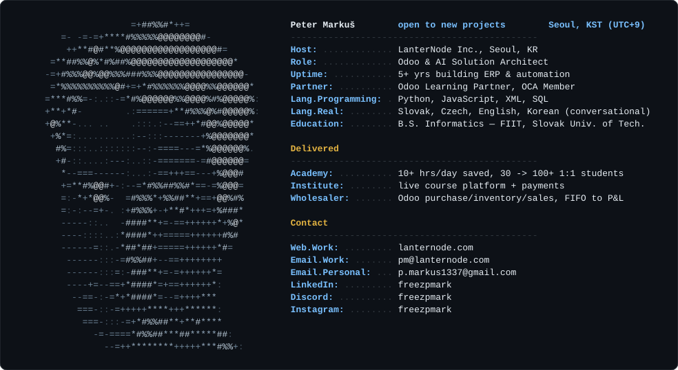

## 📊 Stats:

I build AI systems and Odoo setups for education and service companies. One build cut over 10 hours of daily work for a 1:1 language academy, which went on to grow from 30 to 100+ students.

Odoo brings every part of a business into one place, and at LanterNode I implement it from scoping to deployment. AI takes on the reading, answering and routine work behind it. I build both, so I can tell you what actually fits, and when neither does. If the admin is eating the hours you'd rather spend on the work itself, that's who this is for.

Software engineer turned consultant. I learned early that the hardest problem isn't technical, it's understanding what a business actually needs, then making it work. I've worked in corporate, on contract, in a startup, and on my own SaaS. I read codebases and business processes with equal comfort, and clients get direct access to the person doing the work.

Send me what your week actually looks like and I'll tell you straight whether this is worth doing. pm@lanternode.com

### Writing

- [Odoo vs AI: Should AI Build Your Business Software?](https://www.lanternode.com/blog/insights-6/odoo-vs-ai-should-ai-build-your-business-software-4): where AI genuinely wins at building business software, and the three things it cannot shortcut
- [Odoo Experience 2025: Simplicity at Scale](https://www.lanternode.com/blog/events-1/odoo-experience-2025-simplicity-at-scale-3): notes from Brussels on Odoo 19, company culture, and what changes for implementers

 
<b>💻 Tech Stack (Click Me!)</b>

 
<b>📚 Learning Resources (Click Me!)</b>

 ### Coursera Courses:
 ✔️ Machine Learning: Classification (21 hrs)  
 ✔️ Learning How to Learn (15 hrs)  
 ✔️ AI For Everyone (10 hrs)  
 ✔️ Specialization: Mathematics for Machine Learning and Data Science (60 hrs)  
 ✔️ Specialization: Machine Learning (108 hrs)  
 ✔️ Specialization: Deep Learning (140 hrs)  
 ✔️ Specialization: Natural Language Processing (128 hrs)  
 ✔️ Generative AI with Large Language Models (16 hrs)  

 ### Books:
 ✔️ Programming in Python 3 (Mark Summerfield)  
 ✔️ Building Chatbots with Python (Sumit Raj)  

